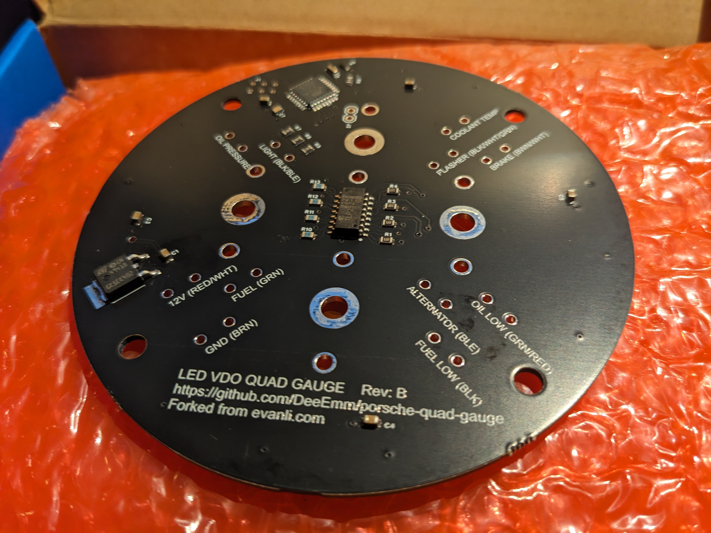

# QUAD GAUGE FOR A PORSCHE 914 / 904 / 356

This is a fork of Evan Li's Porsche Quad Gauge project - https://github.com/Evancli/porsche-quad-gauge

I'm planning on building this for my own 914 but I want to make some small tweaks to the appearance, hence the reason for the fork.

More info on Evans original project can be found on his website -  [here](https://evanli.com/quad-gauge-for-a-porsche-914/).

Great work Evan !!!

## Required Items
This gauge uses salvaged components from a Porsche 944 fuel gauge; the bezel, glass, and face plate. You can used the vintage gauges from the 944 or the corresponding gauges from your 914. It also required two new VDO gauges for voltage and oil pressure.

## Disassembly Tips
It's quite laborious to open these VDO gauges, even with the right tools. A prying spudger and flat implement are needed. Lots of care and attention to not mess up the sheet metal. Be very careful when you pry open the 944 fuel gauge. It's very easy damage the surface finish of the bezel. 

## Processes
The build uses 3D printed parts as well a laser cut and etched parts. 

# Current Status

I have ported the PCB Design to EasyEDA. You can vew the design at - https://oshwlab.com/deeemm/914-quad-gauge-eagle
Or access it directly in the Editor - https://pro.easyeda.com/editor#id=dfc4f779fbf24a139208af90bd0d9e6b

The design is set up for automated pick and place assembly. I've ordered and received 5 assembled boards (this is the minimum order quantity via JLCPCB) 

I also found a suitable 924 combo gauge to use as the base for the conversion, that I will use along with the 911 oil pressure guage I already had.

I also purchased a generic VDO voltage gauge for the 4th position. (Part # 332.030.001C) This looks like it should be the correct style of guage,  but I will not know for sure until I dismantle it.

Next job is to fix my Carvey CNC so that I can make the gauge face, then 3D print the gauge body and PCB mounting bracket and then finally populate the PCB with the gauges and male crimp terminals, Hopefully then I will be ready to test.

NOTE: If you are interested in purchasing a board from me, drop me a DM. I won't ship until I've proven that the one I'm building works and I've finalised my code changes. This might be a while, but... 'first in best dressed' as the say round these parts.

I will supply the PCB pre-loaded, so no need to own a programming device to flash the code. Happy to discuss providing a machined gauge face and case, although you might want to see what mine turn out like first lol.

## License
Shield: [![CC BY-SA 4.0][cc-by-sa-shield]][cc-by-sa]

This work is licensed under a
[Creative Commons Attribution-ShareAlike 4.0 International License][cc-by-sa].

[![CC BY-SA 4.0][cc-by-sa-image]][cc-by-sa]

[cc-by-sa]: http://creativecommons.org/licenses/by-sa/4.0/
[cc-by-sa-image]: https://licensebuttons.net/l/by-sa/4.0/88x31.png
[cc-by-sa-shield]: https://img.shields.io/badge/License-CC%20BY--SA%204.0-lightgrey.svg

